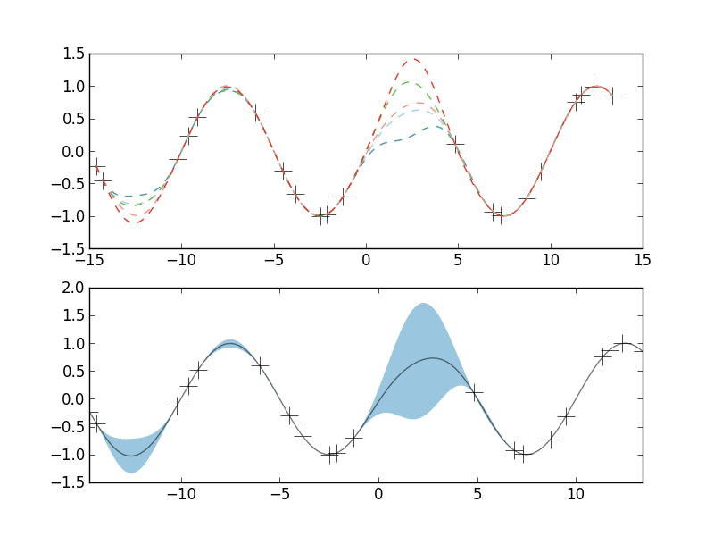

# Gaussian Processes

Some notes and code as I finally work through the [Rasmussen & Williams book](http://www.gaussianprocess.org/gpml/).

# Contents
1. [Use](#use)
2. [Kernels](#kernels)
3. [Sampling a GP](#sampling a gp)
4. [Fitting](#fitting)
5. [Posterior](#posterior)

# Use

If you really just want to dive in and use the provided code, just clone the repo and install the required libraries.

Set up and activate a virtual environment.

```
cd some-file-path/gp
virtualenv env
source env/bin/activate
```

Then use pip to install required packages.

```
pip install -r requirements.txt
```

Then just run the main method in gp.py 

```
python gp.py -kernel se --length_scale 2 --sigma 1
```
This will result in two output images which provide visualizations of Gassian Process prior and posterior. Much more explanation of that follows below.




# Kernels
 TODO

# Sampling a GP
 TODO

# Fitting
 TODO

# Posterior
 TODO
